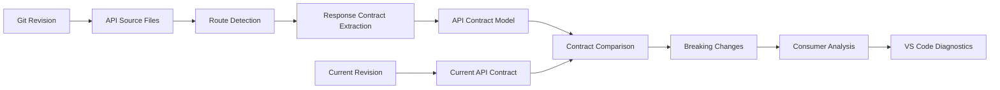
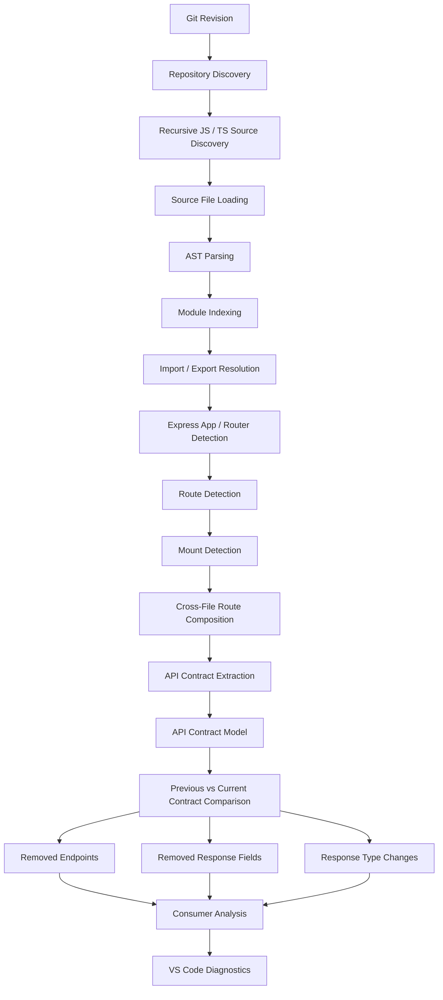

<div align="center">

# API Contract Guardian

### Detect breaking API contract changes before they reach consumers.

A VS Code extension that detects breaking API contract changes across Git revisions in JavaScript and TypeScript repositories.

[](#releases)
[](https://www.typescriptlang.org/)
[](https://developer.mozilla.org/en-US/docs/Web/JavaScript)
[](https://code.visualstudio.com/)
[](https://nodejs.org/)
[](https://git-scm.com/)
[](LICENSE)

**Git-aware API analysis · Repository-wide discovery · Cross-file routing · VS Code diagnostics**


</div>

---
## 📦 Installation

API Contract Guardian is available on the Visual Studio Marketplace.

### Install from VS Code

1. Open Visual Studio Code.
2. Open the Extensions panel using `Ctrl + Shift + X`.
3. Search for **API Contract Guardian**.
4. Select API Contract Guardian by **komallsingh**.
5. Click **Install**.


You can also visit the [API Contract Guardian Marketplace page](https://marketplace.visualstudio.com/items?itemName=komallsingh.api-contract-guardian) to view the extension and install it.

### Install from VSIX

You can also download the `.vsix` file from the project's [GitHub Releases](https://github.com/komallsingh/api-contract-guardian/releases) and install it manually:

1. Open the Extensions panel in VS Code.
2. Click the **...** menu.
3. Select **Install from VSIX...**.
4. Choose the downloaded `.vsix` file.

---

## Overview

APIs often evolve faster than their consumers.

An endpoint may be removed, a response field may disappear, or a response type may change without an obvious signal to the developer working on the API.

**API Contract Guardian** analyzes API contracts across Git revisions and surfaces potentially breaking changes directly inside VS Code.

Instead of discovering compatibility problems at runtime, developers can identify contract changes while working on the codebase.

### Guardian detects

* Removed API endpoints
* Removed response fields
* Response field type changes
* Potentially affected JavaScript and TypeScript consumers
* Added, modified, and deleted API source files
* Cross-file Express router composition
* Nested router mounts
* JavaScript and TypeScript module relationships
* API contract differences across Git revisions

---

## What Problem Does It Solve?

Consider an API that originally returns:

```json
{
  "id": 1,
  "name": "Komal",
  "email": "komal@example.com"
}
```

If `email` is removed in a later revision, existing consumers that depend on that field may break even though the server still starts successfully.

Guardian uses the previous Git revision as a source of the previous API contract and compares it with the current repository.

The result is a development-time signal for potentially breaking API changes.

---

## Why API Contract Guardian?

### Git-aware

Git already contains previous versions of the source code.

Guardian uses Git revisions to derive and compare API contracts instead of requiring developers to manually maintain historical contracts.

### Static analysis

Guardian analyzes JavaScript and TypeScript source code rather than executing the application.

This allows contract analysis during development without requiring the API server to be running.

### Repository-wide discovery

V2 analyzes the repository as a connected system rather than treating every API source file independently.

An API can be distributed across multiple modules, imports, exports, routers, and mount points.

### Structure-based detection

Guardian does not depend on fixed endpoint names or variable names such as `app` or `router`.

It analyzes the structure and relationships of the source code to identify Express applications, routers, routes, and mounts.

---

# V1 — Core API Contract Detection

V1 established the core API contract analysis and Git comparison capabilities.

### V1 capabilities

* [x] Detect removed API endpoints
* [x] Detect removed response fields
* [x] Detect changed response field types
* [x] Extract response contracts from `res.json()`
* [x] Identify potentially affected JavaScript and TypeScript consumers
* [x] Compare Git revisions
* [x] Report findings through the VS Code Problems panel
* [x] Support JavaScript
* [x] Support TypeScript
* [x] Perform file-level API analysis

### V1 Architecture



V1 provided the foundation for the repository-wide analysis introduced in V2.

---

# V2 — Repository-Wide API Discovery

Version 2.0.0 expands Guardian from file-level contract analysis into repository-wide API discovery.

### V2 capabilities

* [x] Repository-wide source discovery
* [x] Recursive JavaScript and TypeScript source discovery
* [x] Generated/dependency directory filtering
* [x] Cross-file module indexing
* [x] Relative import resolution
* [x] JavaScript and TypeScript extension resolution
* [x] `index.js` / `index.ts` module resolution
* [x] Default imports
* [x] Named imports
* [x] Default exports
* [x] Named exports
* [x] Express application detection
* [x] Express router detection
* [x] `express.Router()` detection
* [x] Router detection without fixed variable names
* [x] `app.use()`-style mount detection
* [x] Router-to-router mounts
* [x] Nested router composition
* [x] Multiple mounts of the same router
* [x] Final composed route paths
* [x] Repository-wide API contract discovery
* [x] Git revision comparison
* [x] Consumer impact analysis
* [x] VS Code diagnostics

### V2 Architecture



The major architectural change in V2 is that API discovery happens across the repository before contract comparison.

---

# V1 → V2 Evolution

| V1                         | V2                                                    |
| -------------------------- | ----------------------------------------------------- |
| File-level API analysis    | Repository-wide API discovery                         |
| Direct route detection     | Cross-file route composition                          |
| Limited module awareness   | Module indexing and resolution                        |
| Individual router analysis | Nested router composition                             |
| Contract comparison        | Repository-wide contract comparison                   |
| JavaScript / TypeScript    | JavaScript / TypeScript with cross-file relationships |

V2 is therefore not simply an expanded test suite. It introduces a broader discovery architecture capable of understanding how APIs are connected across source files.

---

# Example

## Contract Change

An API initially returns:

```json
{
  "id": 1,
  "name": "Komal",
  "email": "komal@example.com"
}
```

A later Git revision removes `email`.

Guardian compares the two contracts and reports:

```text
Response field "email" was removed from GET /api/v1/customers
```

If a statically detectable consumer accesses `data.email`, Guardian can additionally report potential consumer impact.

---

# V2 Example — Cross-File Routing

V2 can resolve an API distributed across multiple files:

```text
server.ts
    |
    +-- app.use("/api", apiRouter)
                              |
                              +-- apiRouter.use("/v1", customerRouter)
                                                               |
                                                               +-- GET "/customers"
```

Guardian resolves the composed route as:

```text
GET /api/v1/customers
```

This allows the contract comparison engine to work with the actual API path rather than treating each source file in isolation.

---

# Supported API Patterns

## Express

Guardian currently supports statically detectable Express-style patterns including:

* `express()`
* `express.Router()`
* Express application routes
* Express router routes
* HTTP methods such as `get`, `post`, `put`, `patch`, and `delete`
* `res.json({...})`
* `app.use()`-style mounts
* Router-to-router mounts

## Modules

Guardian supports:

* Relative imports
* Default imports
* Named imports
* Default exports
* Named exports
* JavaScript/TypeScript extension resolution
* `index.js` / `index.ts` module resolution

## Route Composition

Guardian can compose routes across multiple mount levels.

For example:

```text
/api
  + /v1
      + /customers
```

becomes:

```text
/api/v1/customers
```

The same router can also be mounted at multiple paths.

---

# Git Comparison

Guardian uses Git revisions as the source of historical API contracts.

```text
Previous Git Revision
        |
        v
Previous API Contract

Current Git Revision
        |
        v
Current API Contract

        |
        v
Contract Comparison
        |
        v
Potential Breaking Changes
```

V2 performs repository-wide discovery for the revisions being compared.

This is important because an API route may depend on several source files, while only some of those files may have changed.

---

# Consumer Impact Analysis

Guardian can identify statically detectable JavaScript and TypeScript consumers that access changed response fields.

For example, if an API response field is removed and a consumer contains:

```javascript
data.email
```

Guardian can report:

```text
Potentially affected consumer:
response field "email" is used for GET /api/v1/customers
```

Consumer analysis is intentionally conservative.

A consumer warning represents **potential impact**, not guaranteed runtime failure.

---

# VS Code Problems Integration

Detected changes are reported through the VS Code Diagnostics API.

Example findings include:

```text
Error    Response field "email" was removed from GET /api/v1/customers
Warning  Response field "id" changed type from number to string
Warning  Potentially affected consumer: response field "email"
```

This allows developers to inspect API compatibility issues alongside other development problems.

A recommended project screenshot is the VS Code Problems panel showing one or more real Guardian diagnostics.

```markdown

```

---

# Language Support

## API Detection

Currently supported:

* JavaScript
* TypeScript

## Consumer Analysis

Currently supported:

* JavaScript
* JSX
* TypeScript
* TSX

The language-specific parsing layer is separated from the core contract comparison engine, allowing additional languages to be introduced later.

---

# Project Structure

The project separates repository discovery, language analysis, contract comparison, and VS Code integration.

```text
src/
│
├── core/
│   ├── API Contract Models
│   ├── Git Integration
│   ├── Contract Loading
│   ├── Contract Comparison
│   ├── API Discovery
│   └── Consumer Analysis
│
├── languages/
│   └── javascript/
│       ├── Parser
│       ├── Route Detection
│       ├── Response Extraction
│       ├── Module Indexing
│       ├── Module Resolution
│       ├── Mount Detection
│       └── Route Composition
│
├── vscode/
│   └── Diagnostics
│
└── test/
    ├── Unit Tests
    ├── Integration Tests
    └── E2E Tests
```

---

# Design Principles

### Static analysis

Guardian analyzes source code rather than executing the API.

### Git-aware comparison

Previous API contracts are derived from Git revisions.

### Repository-wide discovery

API relationships can span multiple files and directories.

### No fixed variable names

Guardian does not require Express objects to be named `app`, `router`, or another predefined name.

### Separation of concerns

The core contract engine is independent from the VS Code diagnostics layer.

### Conservative analysis

Potential consumer impact is reported as a warning rather than being presented as a guaranteed runtime failure.

---

# Current Limitations

API Contract Guardian focuses on statically detectable JavaScript and TypeScript API contracts.

Current limitations include:

* JavaScript and TypeScript only
* Primarily Express-style API detection
* Static analysis rather than runtime execution
* Dynamic route construction may not be resolvable
* Dynamic response objects may not be fully inferable
* Complex cross-file data flow may not be resolved
* Arbitrary HTTP clients may not be recognized
* Framework-specific routing outside supported patterns may not be detected
* Dynamic URLs may not be associated with a specific API endpoint
* Complex runtime-generated modules may not be resolvable

For example, a dynamically constructed URL or response object may not provide enough static information for Guardian to determine the complete API contract.

These limitations are intentional: Guardian prioritizes reliable, statically supported findings over speculative analysis.

---

# Testing

The project includes multiple levels of testing.

### Unit Tests

Individual components such as:

* Route detection
* Response extraction
* Contract comparison
* Module resolution
* Consumer parsing
* Mount detection
* Route composition

### Integration Tests

Interactions between:

* Git revision loading
* Repository discovery
* Module indexing
* Import resolution
* Express detection
* Route composition
* Contract extraction
* Contract comparison

### End-to-End Tests

The complete extension workflow, including:

* Git-based scanning
* Added API files
* Modified API files
* Deleted API files
* Cross-file routing
* Nested router composition
* Consumer analysis
* VS Code diagnostics
* Cross-platform source-file handling

Run the test suite with:

```bash
npm test
```

---

# Quick Start

## Prerequisites

* VS Code
* Node.js
* npm
* Git

## Clone

```bash
git clone <YOUR_GITHUB_REPOSITORY_URL>
cd api-contract-guardian
```

## Install dependencies

```bash
npm install
```

## Compile

```bash
npm run compile
```

## Run tests

```bash
npm test
```

## Type checking

```bash
npm run check-types
```

## Linting

```bash
npm run lint
```

---

# Installing the VSIX

Package the extension with:

```bash
npx @vscode/vsce package
```

This generates:

```text
api-contract-guardian-2.0.0.vsix
```

Install it from VS Code:

```text
Extensions
→ ...
→ Install from VSIX...
→ api-contract-guardian-2.0.0.vsix
```

If the extension is later published to the VS Code Marketplace, the installation instructions can be updated accordingly.

---

# Running a Scan

1. Open a Git repository containing your JavaScript or TypeScript API.
2. Open the VS Code Command Palette.
3. Run:

```text
API Contract Guardian: Scan
```

4. Enter the Git revision to compare against, such as:

```text
HEAD~1
```

5. Open the **Problems** panel to inspect detected contract changes.

---

# Development

Install dependencies:

```bash
npm install
```

Run type checking:

```bash
npm run check-types
```

Run linting:

```bash
npm run lint
```

Run tests:

```bash
npm test
```

Compile the extension:

```bash
npm run compile
```

Package the extension:

```bash
npx @vscode/vsce package
```

---

# Releases

## v2.0.0

### Repository-Wide API Discovery

Major improvements:

* Repository-wide JavaScript/TypeScript discovery
* Cross-file module indexing
* Import/export resolution
* Express application detection
* Express router detection
* Router mount detection
* Nested router composition
* Multiple router mounts
* Final composed API paths
* Repository-wide API contract discovery
* Git revision comparison
* Consumer impact analysis
* Improved VS Code diagnostics

## v1.0.0

### Core API Contract Detection

Initial capabilities:

* API endpoint detection
* Response contract extraction
* Removed response field detection
* Response field type comparison
* Consumer impact analysis
* Git-based comparison
* VS Code Problems integration

---

# Roadmap

## V1

Core API contract detection.

Status: Complete

## V2

Repository-wide JavaScript/TypeScript discovery.

Status: Complete

Includes:

* Cross-file routing
* Module resolution
* Express router composition
* Repository-wide API discovery
* Git-aware comparison

## V3

Additional language support.

Planned languages:

* Python
* Java
* Go

---

# Contributing

Contributions, bug reports, suggestions, and feature requests are welcome.

### Development workflow

Create a feature branch:

```bash
git checkout -b feature/your-feature
```

Install dependencies:

```bash
npm install
```

Make the required changes and add tests for new behavior.

Before opening a Pull Request, run:

```bash
npm test
npm run lint
npm run check-types
```

Commit your changes:

```bash
git commit -m "Add your feature"
```

Push your branch:

```bash
git push origin feature/your-feature
```

Then open a Pull Request.

---

# Tech Stack

| Category           | Technology                       |
| ------------------ | -------------------------------- |
| Language           | TypeScript                       |
| API Analysis       | JavaScript / TypeScript          |
| Static Analysis    | AST-based parsing                |
| API Framework      | Express-style APIs               |
| Consumer Analysis  | JavaScript, JSX, TypeScript, TSX |
| Editor Integration | VS Code Extension API            |
| Version Control    | Git                              |
| Runtime            | Node.js                          |
| Testing            | Unit, Integration, E2E           |
| Packaging          | VSIX                             |

---

# License

This project is licensed under the **MIT License**.

See [LICENSE](LICENSE) for details.

---

# Author

**Komal Singh**

Software Developer · Backend Developer · Open Source Contributor

---

<div align="center">

## API Contract Guardian

**Catch breaking API changes before they reach consumers.**

⭐ If you find the project useful, consider starring the repository.


</div>
