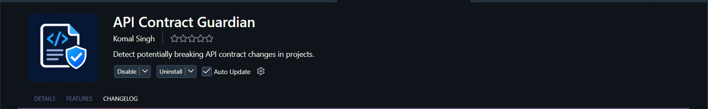

<div align="center">

# 🛡️ API Contract Guardian

### Catch breaking API changes before they reach consumers.

A VS Code extension that compares API contracts across Git revisions, detects potentially breaking changes, and reports them directly in the VS Code Problems panel.


</div>

---
## 📦 Installation

API Contract Guardian is available on the Visual Studio Marketplace.

### Install from VS Code

1. Open Visual Studio Code.
2. Open the Extensions panel using `Ctrl + Shift + X`.
3. Search for **API Contract Guardian**.
4. Select API Contract Guardian by **komallsingh**.
5. Click **Install**.



You can also visit the [API Contract Guardian Marketplace page](https://marketplace.visualstudio.com/items?itemName=komallsingh.api-contract-guardian) to view the extension and install it.

### Install from VSIX

You can also download the `.vsix` file from the project's [GitHub Releases](https://github.com/komallsingh/api-contract-guardian/releases) and install it manually:

1. Open the Extensions panel in VS Code.
2. Click the **...** menu.
3. Select **Install from VSIX...**.
4. Choose the downloaded `.vsix` file.

---

## 📖 Overview

API contracts can change frequently during development.

An endpoint may be removed, a response field may disappear, or a field's type may change — all of which can potentially break existing consumers.

**API Contract Guardian** helps developers detect these changes before they reach downstream consumers.

The extension compares API contracts between Git revisions and reports potentially breaking changes directly inside the **VS Code Problems panel**.

Guardian can detect:

* ❌ Removed API endpoints
* ❌ Removed response fields
* ⚠️ Response field type changes
* ⚠️ Potentially affected JavaScript/TypeScript consumers
* 🔀 Added, modified, and deleted API source files

Instead of discovering API compatibility problems at runtime, developers can identify them during development.

---

## ✨ Features

### 🔌 API Endpoint Detection

Guardian analyzes JavaScript and TypeScript API source files and identifies API routes such as:

```javascript
app.get("/users/:id", handler);
```

If an endpoint existed in the previous Git revision but has been removed, Guardian reports:

```text
API endpoint removed: GET /users/:id
```

---

### 📦 Response Contract Detection

Guardian extracts response fields from API responses.

For example, a previous response:

```json
{
  "id": 1,
  "email": "komal@example.com"
}
```

becoming:

```json
{
  "id": 1
}
```

produces:

```text
Response field removed: email
```

---

### 🔄 Response Field Type Changes

Guardian detects changes to response field types.

For example:

```text
id: number
```

changing to:

```text
id: string
```

is reported as a potentially breaking response-contract change.

---

### 👥 Consumer Impact Analysis

Guardian can identify statically detectable JavaScript and TypeScript consumers that access changed response fields.

For example:

```javascript
const user = fetch("/users");

user
  .then(response => response.json())
  .then(data => console.log(data.email));
```

If `email` is removed from the `/users` response, Guardian can report:

```text
Potentially affected consumer:
response field "email" is used for GET /users
```

Consumer analysis is intentionally conservative.

Dynamic URLs, unsupported HTTP clients, and complex data-flow patterns may not be detected.

---

### 🌳 Git-Aware Comparison

Guardian understands changes between Git revisions, including:

* ➕ Added files
* ✏️ Modified files
* ➖ Deleted files

This allows API contracts to be compared even when API source files are added or removed between revisions.

---

### 🐛 VS Code Problems Integration

Detected breaking changes are reported using VS Code diagnostics.

This allows developers to see API compatibility issues directly inside the **VS Code Problems panel**.

---

## 🔍 What It Detects

| Change                 | Example                  | Result                       |
| ---------------------- | ------------------------ | ---------------------------- |
| Removed endpoint       | `GET /users/:id` removed | ❌ Breaking change            |
| Removed response field | `email` removed          | ❌ Breaking change            |
| Field type change      | `id: number → string`    | ⚠️ Potentially breaking      |
| Consumer usage         | `data.email`             | ⚠️ Potential consumer impact |
| Deleted API file       | API source file removed  | ❌ Contract changes detected  |

---

## 🔄 How It Works

```text
Git Revision
     ↓
Changed Files
     ↓
Language Parser
     ↓
API Contract Extraction
     ↓
Contract Comparison
     ↓
Breaking Changes
     ↓
Consumer Analysis
     ↓
VS Code Diagnostics
```

The core comparison engine is kept separate from the VS Code-specific layer.

---

## 🏗 Architecture

```text
src/
│
├── core/
│   ├── API Contract Models
│   ├── Git Integration
│   ├── Contract Loading
│   ├── Contract Comparison
│   └── Consumer Analysis
│
├── languages/
│   └── javascript/
│       ├── Route Detection
│       ├── Response Extraction
│       ├── API Parser
│       └── Consumer Parser
│
├── vscode/
│   └── Diagnostics
│
└── test/
    ├── Unit Tests
    ├── Integration Tests
    └── E2E Tests
```

---

## 🧠 Tech Stack

| Category           | Technology                       |
| ------------------ | -------------------------------- |
| Language           | TypeScript                       |
| API Detection      | JavaScript + TypeScript          |
| Consumer Analysis  | JavaScript, JSX, TypeScript, TSX |
| Editor Integration | VS Code Extension API            |
| Version Control    | Git                              |
| Runtime            | Node.js                          |
| Testing            | Unit + Integration + E2E         |
| Static Analysis    | AST-based parsing                |

---

## 🌐 Language Support

### API Detection

Guardian currently supports:

* JavaScript
* TypeScript

### Consumer Analysis

Guardian currently supports:

* JavaScript
* JSX
* TypeScript
* TSX

The parser architecture is language-independent, allowing additional languages to be added later.

---

## 🚀 Usage

1. Open your Git repository in VS Code.
2. Open the Command Palette:

```text
Ctrl + Shift + P
```

3. Run:

```text
API Contract Guardian: Scan
```

4. Enter the Git revision to compare against, for example:

```text
HEAD~1
```

5. View the detected changes in the **VS Code Problems panel**.

---

---

## ⚙️ Development

### Clone the Repository

```bash
git clone <repository-url>
cd api-contract-guardian
```

### Install Dependencies

```bash
npm install
```

### Type Checking

```bash
npm run check-types
```

### Linting

```bash
npm run lint
```

### Run Tests

```bash
npm test
```

### Compile the Extension

```bash
npm run compile
```

---

## 🧪 Testing

The project includes unit, integration, and end-to-end tests covering:

* Express route detection
* Response extraction
* JavaScript/TypeScript parsing
* Git revision loading
* Added Git files
* Modified Git files
* Deleted Git files
* API contract comparison
* Consumer analysis
* VS Code diagnostics
* Cross-platform source-file handling

### Unit Tests

Tests individual components such as:

* Route detection
* Response extraction
* Contract comparison
* Consumer parsing

### Integration Tests

Tests interactions between:

* Git revision loading
* API parsing
* Contract extraction
* Contract comparison

### End-to-End Tests

Tests the complete extension workflow including:

* Git-based scanning
* VS Code diagnostics
* Consumer analysis
* Cross-platform source-file handling

---

## 🛡️ Design Principles

### Conservative Analysis

Guardian does not assume that every detected consumer will definitely break.

Consumer warnings represent **potential impact** rather than guaranteed runtime failures.

---

### Git-Aware

API contracts are compared using actual Git revisions.

```text
Previous Revision
        ↓
Current Revision
        ↓
Contract Difference
```

---

### Separation of Concerns

The contract analysis engine is separated from the VS Code layer.

```text
Core Engine
     ↓
Contract Analysis
     ↓
VS Code Adapter
     ↓
Diagnostics
```

This makes the core functionality easier to test and maintain.

---

## ⚠️ Limitations

API Contract Guardian focuses on **statically detectable API contracts**.

It does not attempt to fully understand:

* Dynamic API URLs
* Runtime-generated routes
* Arbitrary HTTP clients
* Complex cross-file data flow
* Runtime API behavior
* Every possible JavaScript/TypeScript coding pattern

For example:

```javascript
fetch(getDynamicUrl());
```

may not be statically associated with a specific API endpoint.

Therefore, consumer warnings should be treated as **potential impact signals**, not proof of a runtime failure.

---

## 🤝 Contributing

Contributions, suggestions, bug reports, and feature requests are welcome.

If you would like to contribute:

1. Fork the repository
2. Create a feature branch

```bash
git checkout -b feature/your-feature
```

3. Install dependencies

```bash
npm install
```

4. Make your changes
5. Run the test suite

```bash
npm test
```

6. Run linting and type checking

```bash
npm run lint
npm run check-types
```

7. Commit your changes

```bash
git commit -m "Add your feature"
```

8. Push the branch and open a Pull Request

---

## 👩‍💻 Author

**Komal Singh**

Software Developer • Backend Developer • Open Source Contributor

---

## 📄 License

This project is licensed under the MIT License.

See the `LICENSE` file for more information.

---

<div align="center">

⭐ If you find **API Contract Guardian** useful, consider starring the repository.

</div>
